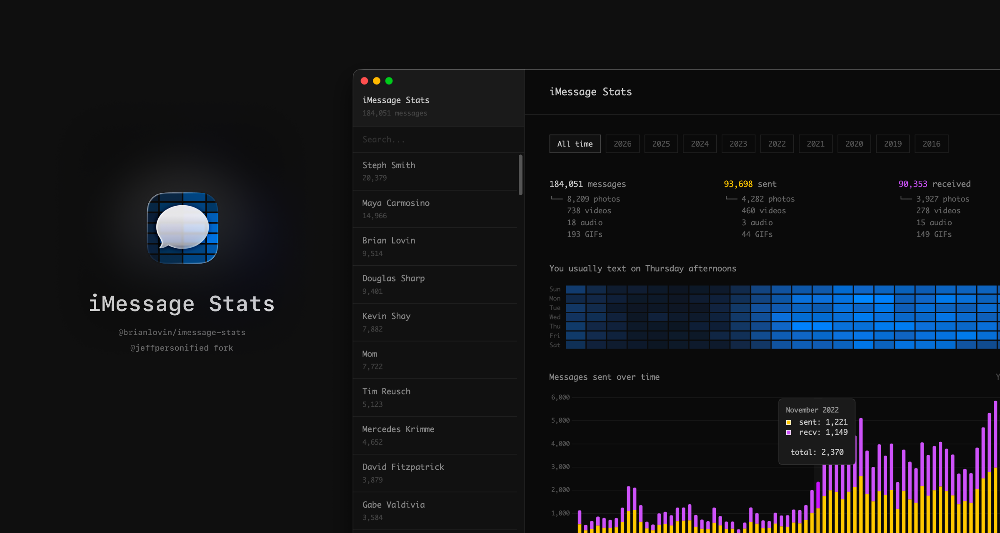

# iMessage Stats

Analyze your iMessage history to see who you text the most. Visualize messaging patterns over time.



## Features

- **Top contacts** ranked by total message count
- **Sent vs received** breakdown for each contact
- **Timeline visualization** with monthly and yearly views
- **Search** to quickly find specific contacts
- **100% local** - your data never leaves your computer

## Requirements

- macOS (uses iMessage and Contacts databases)

## Installation

Choose one of two installation methods:

### Option 1: Mac App (Recommended)

The easiest way to use iMessage Stats is with the native Mac app.

1. **[Download iMessage Stats](https://github.com/jeffpersonified/imessage-stats/releases/download/v1.0.0/iMessage.Stats-1.0.0-arm64.dmg)** (macOS, Apple Silicon)
2. **Open** the DMG and drag iMessage Stats to Applications
3. **Launch** the app and grant Full Disk Access when prompted

The app will automatically read your iMessage and Contacts databases - no manual file copying required.

> **Why Full Disk Access?** macOS protects your Messages database at `~/Library/Messages/chat.db`. Any app that reads your iMessage history needs this permission - there's no way around it. If you're uncomfortable granting this access, use Option 2 below where you manually copy the files yourself.
>
> **Is this safe?** This app is [fully open source](https://github.com/jeffpersonified/imessage-stats). It runs 100% locally, makes no network requests, and you can audit every line of code. Your messages never leave your computer.

### Option 2: Command Line (No Special Permissions)

If you'd rather not grant Full Disk Access, you can manually copy your data and run Python scripts. This method requires Python 3.8+ but doesn't need any special permissions since you're copying the files yourself.

#### 1. Clone the repo

```bash
git clone https://github.com/jeffpersonified/imessage-stats.git
cd imessage-stats
```

#### 2. Copy your iMessage + Contacts data

Open **Finder**, press `Cmd+Shift+G`, and copy these to the project folder:

| Copy from                                           | To                       |
| --------------------------------------------------- | ------------------------ |
| `~/Library/Messages/chat.db`                        | `imessage-stats/chat.db` |
| `~/Library/Application Support/AddressBook/Sources` | `imessage-stats/Sources` |

Your project folder should now contain:

```
imessage-stats/
├── chat.db          ← your iMessage database
├── Sources/         ← your contacts
├── scripts/
├── web/
└── ...
```

#### 3. Run it

```bash
./scripts/start
```

This exports your data, starts a local server, and opens your browser.

## Command Line Options

```bash
./scripts/start --limit 50      # Only export top 50 contacts
./scripts/build                 # Just export data (no server)
./scripts/serve                 # Just start server
./scripts/serve 3000            # Use a different port
```

## Notion Sync (Optional)

Sync your stats to a Notion database for easy sharing or further analysis.

### 1. Install uv

```bash
brew install uv
```

### 2. Create a Notion integration

1. Go to [notion.so/my-integrations](https://www.notion.so/my-integrations)
2. Click "New integration"
3. Name it (e.g., "iMessage Stats")
4. Click "Submit"
5. Copy the "Internal Integration Secret" (starts with `secret_`)

### 3. Create an empty database in Notion

Create a new database anywhere in your workspace. The script will automatically add the required columns.

### 4. Share the database with your integration

Open your database in Notion → "..." menu → "Connections" → add your integration.

### 5. Get the database ID

The database ID is in the URL when viewing your database:

```
https://notion.so/workspace/DATABASE_ID?v=...
                            ^^^^^^^^^^^
```

Copy the 32-character ID (the part before `?v=`).

### 6. Configure your credentials

```bash
cp .env.example .env
```

Edit `.env` with your API key and database ID.

### 7. Sync

```bash
uv run --with requests --with python-dotenv python scripts/notion_sync.py
```

The script will add the required columns and sync your contacts. Run it again anytime to update.

## Privacy

**Your data stays on your computer.** This tool:

- Reads your local iMessage and Contacts databases
- Generates JSON files for visualization
- Runs entirely locally
- Never sends data anywhere

The `chat.db`, `Sources/`, and `web/data/` directories are all gitignored to prevent accidentally committing personal information.

## How It Works

### iMessage Database

macOS stores iMessage history in a SQLite database at `~/Library/Messages/chat.db`. The key tables are:

- `message` - Individual messages with timestamps and `is_from_me` flag
- `handle` - Contact identifiers (phone numbers, emails)
- `chat` - Conversations (1-on-1 or group)
- `chat_message_join` - Links messages to chats
- `chat_handle_join` - Links handles to chats

### Contacts Database

Contact names are stored in `~/Library/Application Support/AddressBook/Sources/*/AddressBook-v22.abcddb`. The script matches phone numbers and emails to names.

## Troubleshooting

### "Database not found" error

Make sure you copied `chat.db` and `Sources/` into the project folder. Check:

```bash
ls -la chat.db Sources/
```

### No contacts showing names

The Contacts sources folder might be empty or in a different location. Try:

```bash
# Find your Contacts databases
find ~/Library -name "AddressBook-v22.abcddb" 2>/dev/null
```

## Credits

Fork of [brianlovin/imessage-stats](https://github.com/brianlovin/imessage-stats) with native Mac app support.
